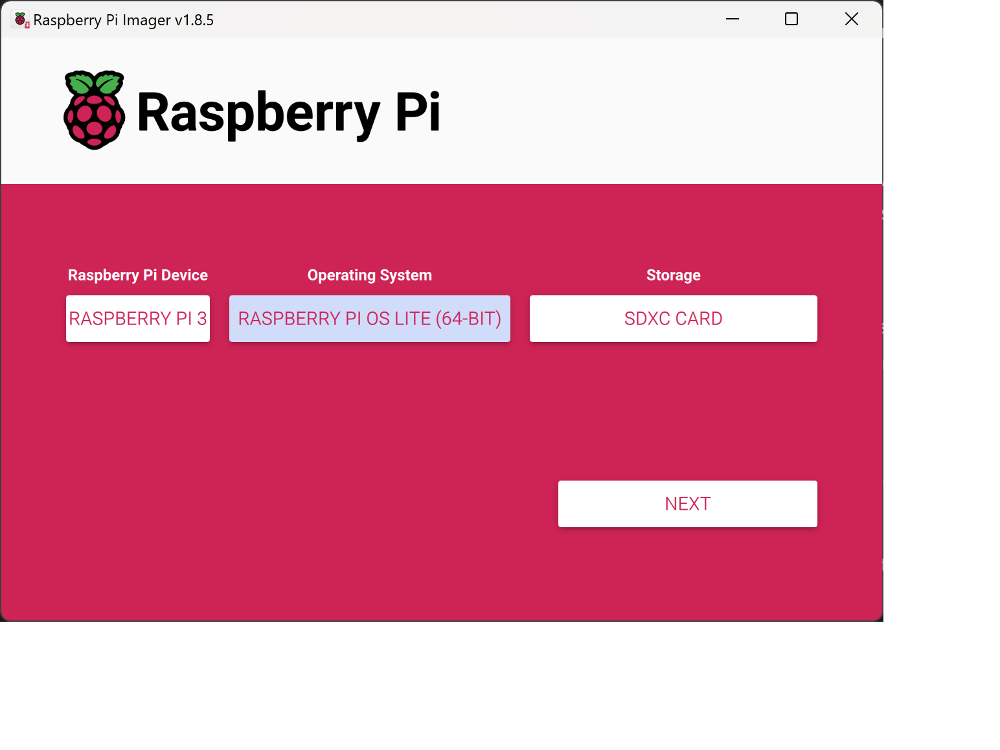
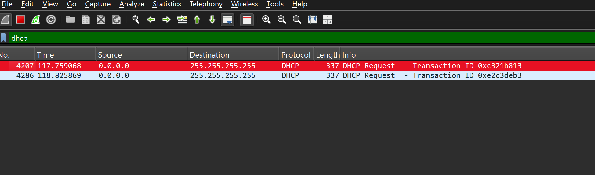

# Seting up Rasberry Pi

This section is only for setting up a fresh SD card. If your Raspberry Pi is already configured, and you can connect to it remotely via SSH, you can skip this.

* Flash Raspberry Pi OS onto the SD Card
Use Raspberry Pi Imager to install the OS (choose the Lite version for faster installation).
During setup, select Advanced Options to configure your username, password, and Wi-Fi access.

* [(Optional) Backup Your SD Card](https://www.makeuseof.com/how-to-back-up-your-raspberry-pi-sd-card-on-windows/
)
* Find the Raspberry Pi’s IP Address. I've used Wireshark:
    * Power off your Raspberry Pi.
    * Start Wireshark and use the capture filter: dhcp to capture DHCP requests.
    * Power on your Raspberry Pi. The IP address will appear in the Wireshark logs (in the bottom left bookmarks search for "Requested IP Address").
    

4. Connect via SSH
Connect to the Raspberry Pi using SSH using credential you set-up while flashing the SD card:
```ssh <username>@<raspberry_pi_ip_address>```

### Notes:
If the Wi-Fi setup fails:
* Manually create a wpa_supplicant.conf file and place it in the root folder of the SD card.
Windows users: ensure there is no hidden .txt extension.
* To find your Wi-Fi SSID (network name) and password on a Windows PC, you can [follow these instructions](https://www.hellotech.com/guide/for/how-to-find-wifi-password-windows-10).
