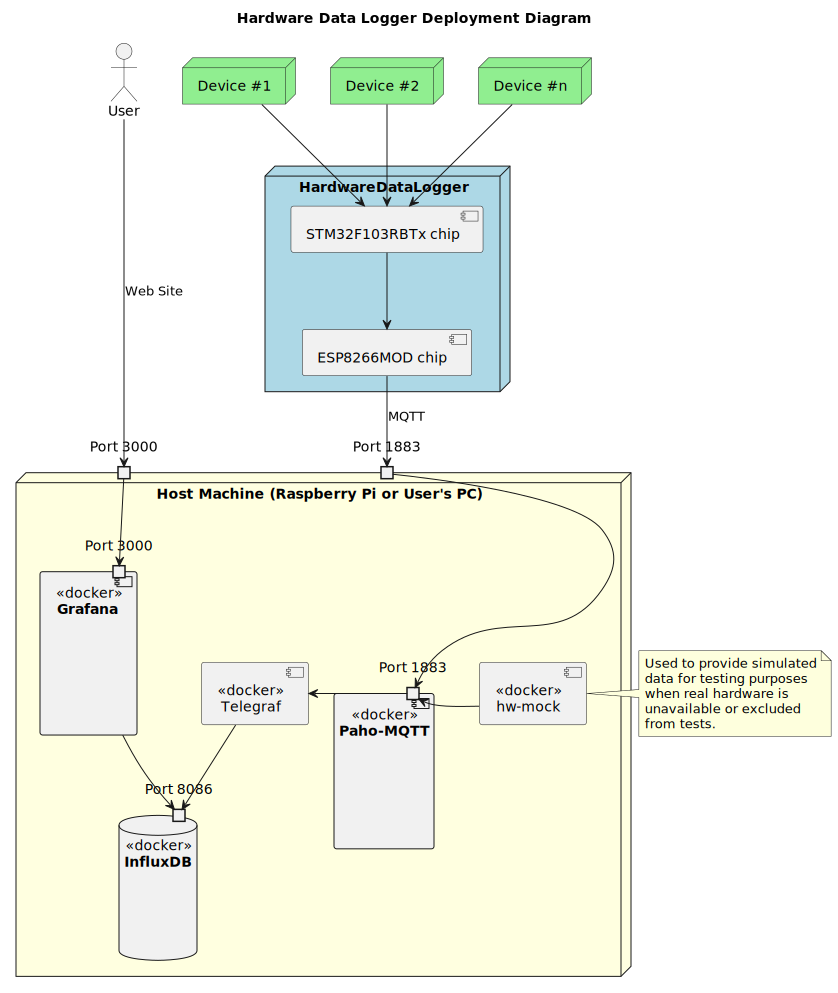

# HardwareDataLogger-RemoteProcessing

## Purpose

This repository is intended to provide data processing and data visualization for [HardwareDataLogger](https://github.com/RobertGawron/HardwareDataLogger). However, it can be repurposed for other devices that communicate with a host (such as a Raspberry Pi) via the MQTT protocol.

The main goal is to:

- Have a web user interface in Grafana.
- Store measurement data in InfluxDB.

## Architecture

Key points:

- Docker Compose is used to manage all software components. These components include:
  - Grafana - A powerful platform for visualizing and analyzing measurement data through customizable dashboards.
  - InfluxDB - A high-performance database optimized for storing time-series data such as measurements and events.
  - Telegraf - A plugin-driven server agent used to collect, process, and send metrics from various sources to InfluxDB.
  - Paho-MQTT - A library for implementing MQTT protocol communication between devices and the system.
- [hw-mock - This is a Linux Docker image with a Python script that can generate fake measurement data to test the system without the need for an actual device (HardwareDataLogger).](./Test/README.md)
- All these components come as ready-to-use Docker images. No code is modified; only the configuration needs to be done. The configuration is kept between restarts of the machine thanks to Docker Compose volumes.

## Setup

[Manual is available here](./DevOps/README.md)
